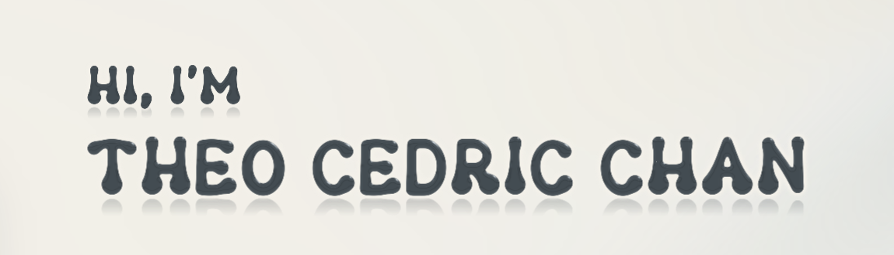

<a href="https://theocedricchan.com">
  <picture>
    <source media="(prefers-color-scheme: dark)" srcset="assets/banner-dark.png">
    
  </picture>
</a>

**Full-stack developer** in Cebu City, Philippines.

I like building things that solve real problems. I usually start with an idea, figure things out as I go, and learn something along the way. Whether it's for the web, desktop, or mobile, I like exploring whatever makes the most sense for what I'm trying to build.

**Currently:** I'm a fourth-year student at Cebu Institute of Technology – University in Cebu City. I'm looking for an internship where I can learn, contribute, and gain experience, while also being open to freelance work.

[Portfolio](https://theocedricchan.com) · [LinkedIn](https://www.linkedin.com/in/theo-cedric-chan-524818406/) · [Email](mailto:theocedricchan28@gmail.com)

## Projects

| Project | What it is | Built with |
| --- | --- | --- |
| [QuickPitik](https://quickpitik.com/) | Marathon photo marketplace for Cebu. Runners find their shots by selfie or bib. | Kotlin, Spring Boot, Next.js, FastAPI |
| [BatchMyPhotos](https://www.batchmyphotos.com/) | Desktop batch-splitter for photographers, with AI blur culling. | Electron, React, Supabase, sharp |
| [Invitica](https://invitica.app/) | Interactive digital invitations. Guests RSVP without an account. | Next.js, Supabase, Turborepo, TypeScript |
| [T.E.K Nurse](https://teknurse.vercel.app/login) | Inventory PWA for a school nursing lab, with QR borrow and return. | Next.js, Supabase, Vercel, PWA |
| [PromptHuddle](https://prompthuddle.vercel.app/login) | A team's prompts, organized into trackable tasks. | Next.js, Supabase, Vercel |
| [PaksitPhotos](https://github.com/theo2815/PaksitPhotosWebsite) | Marathon photo tool with AI face search across an event's uploads. Offline now; the link is the source. | Next.js, Supabase, Vercel |

The details, walkthrough videos and a game of Tetris are on the [portfolio](https://theocedricchan.com).

## Tech stack

- **Languages:** TypeScript, JavaScript, Python, Java, C#, Kotlin, C, C++
- **Frontend:** React, Next.js, Tailwind CSS, GSAP, PWA
- **Backend:** Node.js, Django, FastAPI, Spring Boot, Electron, Trigger.dev
- **Databases & storage:** PostgreSQL, MongoDB, Redis, Supabase, Cloudflare R2, Amazon S3
- **Cloud & deploy:** Vercel, Cloudflare, Cloudflare Workers, Railway, Render, Docker, Amazon EC2, AWS Lambda, Amazon Rekognition
- **Payments:** PayMongo, Stripe
- **Tools:** Git, GitHub, Figma, Playwright, Turborepo
